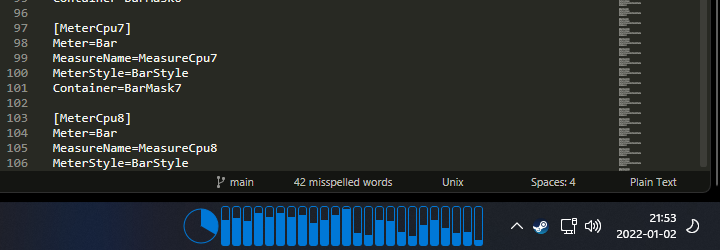

# `kwcpu`

An unobtrusive CPU meter that fits in the default Windows 11 taskbar. Supports up to 32 cores.

`kwcpu` is provided as a [Rainmeter](https://www.rainmeter.net/) skin. By default, the meter will stay as the top-most window, allowing it to be positioned over the Windows taskbar.

Double-clicking the meter will open the task manager. Alternatively there is a custom action in the context menu.
